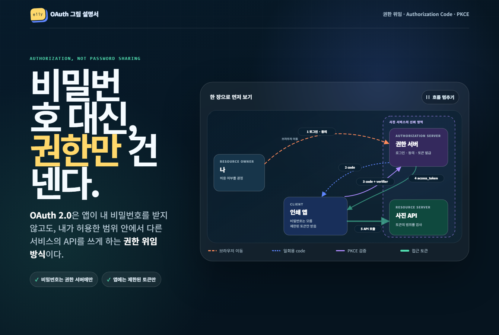

# Source to Sight

[English](README.md) | 한국어

복잡한 주제를 처음 보는 사람도 이해할 수 있는 시각적 결과물로 바꾸는 에이전트 스킬입니다.

범용 프로젝트 설명을 위한 고도화를 진행하고 있습니다. M0 데이터·검증 기반 위에 **M1 `code-flow` 탐색 스킬, 여섯 유형의 탐색 지침, 근거 캡처와 HTML 조립 도구**를 구현했습니다. 코딩 에이전트가 JavaScript·Python·Go의 공개 저장소 여섯 곳을 읽어 사례를 만들었습니다. 독립적인 사람의 사실·이해도 검토가 남아 있으며 범용 지원 전체가 완료된 상태는 아닙니다.

[고도화 계획](plans/source-to-sight-evolution-plan.md) · [개발 및 예시 실행 방법](docs/development.md) · [M1 사례와 출처](eval/m1/README.md) · [M1 구현 상태](eval/reports/m1-verification.md)

M2에서는 기존 18개를 보존하고 유형별 복합 사례를 추가해 [24개 평가 후보](eval/cases.md)로 확대했습니다. 재시도·예외·래퍼·병렬·상태·자원 경계의 탐색 지침과 화면의 분기 조건·실행 방식 표시를 보완했습니다. [평가 기준](eval/rubric.md)과 [비교·검토 도구](docs/evaluation.md)는 필수 행동 주장·경로도 검사합니다. 저장된 후보를 재검증한 임시 기준이며, 독립적인 사람의 사실·이해도 검토는 대기 중입니다.

`$visual-primer` 스킬은 실제 자료와 공식 출처를 확인한 뒤, 큰 그림과 적은 글로 설명하는 단일 HTML 페이지를 만듭니다. 결과물은 빌드 과정이나 별도 서버 없이 브라우저에서 바로 열 수 있습니다.

## 코드 동작 설명 예시

`$code-flow`는 범위가 정해진 기능·공개 API·생명주기·워크플로를 설명합니다. 호스트 에이전트가 실제 코드를 읽어 대상을 찾고 주장을 검토하며, 보조 도구가 근거를 확인하고 HTML로 출력합니다.

```text
$code-flow ToolCallingAgent가 도구를 사용하고 종료하는 흐름을 설명해 줘.
$code-flow Cache.Add가 오래된 항목을 제거하고 콜백을 호출하는 시점을 설명해 줘.
$code-flow Blinker의 Signal.send에서 어떤 수신자가 호출되는지 설명해 줘.
```

| 실제 소스 사례 | 설명 내용 | 생성되는 로컬 페이지 |
| --- | --- | --- |
| strip-ansi | 단일 함수의 입력 검사와 문자열 변환 | `build/m1/utility-strip.html` |
| pluggy | 플러그인 등록과 이후 훅 호출의 차이 | `build/m1/plugin-hooks.html` |
| smolagents | 에이전트 반복·모델/도구 경계·종료 | `build/m1/agent-tool-loop.html` |
| golang-lru | 캐시 퇴출·상태 기록·잠금 해제 후 콜백 | `build/m1/library-eviction.html` |
| httprouter | 일치한 요청을 등록된 핸들러로 전달 | `build/m1/web-dispatch.html` |
| Blinker | 발신자 필터와 순서 없는 수신자 관계 | `build/m1/event-receivers.html` |

[개발 환경 준비](docs/development.md) 후 `npm run m1:sources`, `npm run m1:examples`로 재현합니다. 사례는 에이전트가 소스를 읽어 작성했으며 독립적인 모델 여섯 번의 실험을 뜻하지 않습니다. [사람 검토 자료](eval/reports/m1-human-review.md)는 확인 대기 상태입니다. 생성 HTML에도 승인한 캔버스 UI를 적용했습니다. 구성 요소 검색, 구성/흐름 전환, 이동·확대, 선택 시 근거 패널, 다크모드 저장을 지원합니다. [지도 시안](plans/design/atlas-prototype.html)은 디자인 참고 자료이며, 프로젝트 전체 탐색은 M5 범위입니다.

새 `code-flow`는 이 구현이 있는 체크아웃에서 설치할 수 있습니다.

```bash
npx skills add . --skill code-flow
```

또는 `skills/code-flow` 폴더 전체를 사용하는 호스트의 스킬 디렉터리에 복사합니다. 스크립트·참조 문서·템플릿·글꼴·라이선스를 함께 보존하고, 포함된 `scripts/requirements.txt`로 Python 의존성을 준비합니다. 렌더링에는 다른 스킬이나 Node.js가 필요하지 않습니다. 로컬 소스 설치 방식은 [Skills CLI 문서](https://github.com/vercel-labs/skills#source-formats)에 설명되어 있습니다.

## 개념 설명 생성 결과

다음 한 줄로 OAuth 입문용 그림 설명서를 생성한 예시입니다.

```text
$visual-primer OAuth를 설명해줘
```

[](./assets/oauth-visual-primer-example.html)

[OAuth visual-primer 예제 HTML 보기](assets/oauth-visual-primer-example.html) · GitHub에서 실행 화면이 열리지 않으면 파일을 내려받아 브라우저로 여세요.

이 예시에는 다음 요소가 포함되어 있습니다.

- 의미에 따라 모양이 달라지는 연결선과 분명한 화살표
- Authorization Code + PKCE 데이터 흐름 애니메이션
- 단계별로 직접 진행할 수 있는 PKCE 시뮬레이션
- OAuth와 OpenID Connect의 차이를 보여주는 판단 구조
- 데스크톱과 모바일의 박스·레이어·오버플로 렌더링 QA

## 설치

Agent Skills CLI로 `visual-primer`를 설치합니다.

```bash
npx skills add silbaram/source-to-sight --skill visual-primer
```

설치 후 현재 세션에 스킬이 나타나지 않으면 새 대화를 시작하세요.

## 사용법

스킬 이름과 설명할 주제, 저장할 위치를 함께 적으면 됩니다.

```text
$visual-primer OAuth를 설명해줘. 결과를 docs/oauth-visual-primer-example.html에 저장해.
```

주제와 결과 위치를 자유롭게 바꿀 수 있습니다.

```text
$visual-primer 쿠버네티스의 Pod를 설명해줘. 결과는 현재 프로젝트 root에 생성해줘.
```

결과 파일은 다음 원칙을 따릅니다.

- 배경지식이 없다고 가정하고 실제 용어를 순서대로 소개합니다.
- 핵심 관계를 긴 글보다 큰 그림으로 먼저 보여줍니다.
- 연결선의 방향·모양·색을 관계의 의미에 맞게 구분합니다.
- 시간, 이동, 상태 변화가 중요한 경우에만 애니메이션이나 작은 시뮬레이션을 사용합니다.
- 공식 출처와 확인하지 못한 범위를 페이지 마지막에 기록합니다.
- UTF-8, 반응형 레이아웃, 키보드 포커스와 `prefers-reduced-motion`을 지원합니다.

## 업데이트

설치된 스킬은 다음 명령으로 업데이트합니다.

```bash
npx skills update visual-primer
```

현재 세션에 이전 버전이 남아 있으면 새 대화를 시작한 뒤 `$visual-primer`를 사용하세요.

## 저장소 구조

```text
.
├── README.md
├── README.ko.md
├── skills/code-flow/              # 소스 탐색, 프로파일, 작성 도구, 렌더러
├── docs/                          # 프로젝트 설명과 개발 가이드
├── plans/                         # 개발계획과 UI 설계 제안·시안
├── fixtures/                      # 계약·렌더러의 고정 테스트 입력
├── eval/
│   ├── m1/                        # 고정 소스 분석 사례와 출처
│   ├── m15/                       # 18개 후보와 소스 기반 정답 검토 기준
│   ├── m2/                        # 복합 동작 후보 6개와 경로·행동 검토 기준
│   ├── runs/                      # 보존한 임시 기준 실행 기록
│   └── reports/                   # 검증·리뷰 기록과 보존한 스크린샷
├── skills/visual-primer/
│   ├── SKILL.md
│   └── references/
│       ├── diagram-patterns.md
│       ├── qa.md
│       └── visual-treatment.md
└── assets/
    ├── oauth-visual-primer-example.html
    └── oauth-visual-primer-example-preview.png
```

- `SKILL.md`: `$visual-primer`가 설명을 조사하고 구성하는 핵심 규칙입니다.
- `references/`: 다이어그램, 디자인, 렌더링 QA 기준을 분리해 관리합니다.

프로젝트 안내는 [문서 목록](docs/README.md), 개발 중 검증 자료는 [검증 기록 목록](eval/reports/README.md)에서 확인할 수 있습니다.

이 저장소는 공개 [Agent Skills](https://agentskills.io/) 형식을 사용하며 [`skills` CLI](https://github.com/vercel-labs/skills)로 설치할 수 있습니다.
