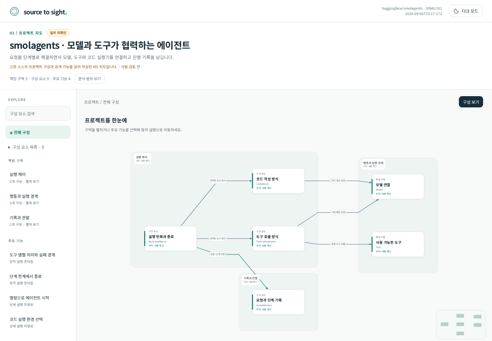
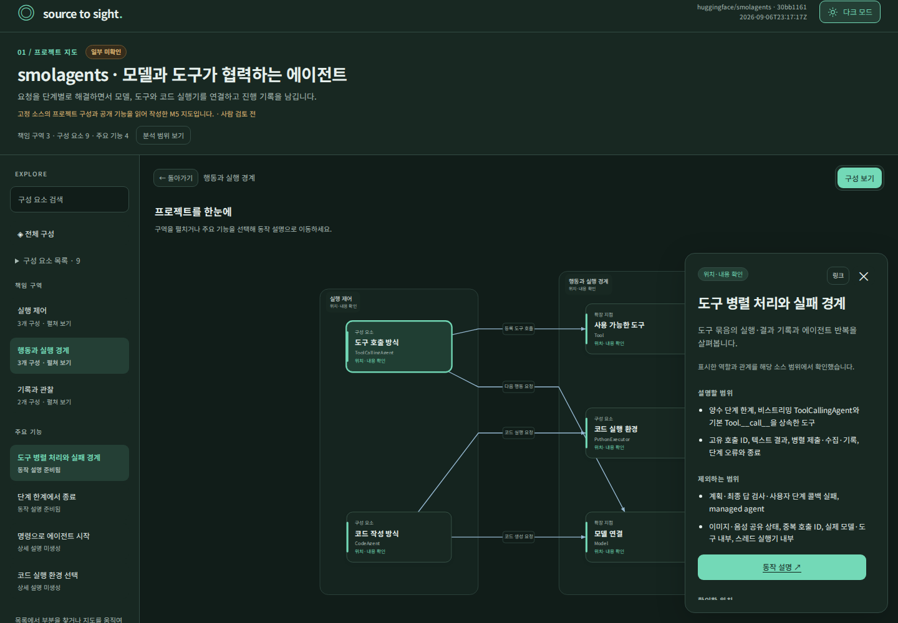
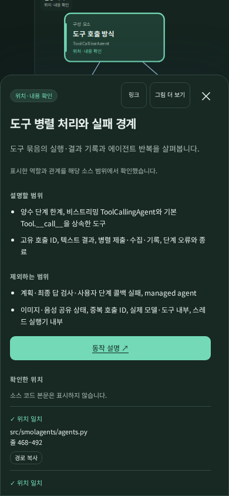

# M5 최종 화면

프로젝트 전체의 책임 구역과 대표 기능을 살펴보고 **지도 → 동작 설명 → 규칙과 이유**로 이동하는 결과입니다. 개발된 코드와 함께 확인할 수 있도록 `build/eval/m5-final/`의 최종 지도를 보관했습니다.

## GitHub에서 화면 보기

아래 미리보기는 GitHub에서 바로 볼 수 있습니다. HTML 파일의 탐색·자동재생은 내려받아 브라우저에서 사용합니다. GitHub 파일 화면의 **Download raw file** 버튼으로 개별 파일을 받을 수 있습니다([GitHub 안내](https://docs.github.com/en/repositories/working-with-files/using-files/viewing-and-understanding-files)). 연결된 페이지까지 확인하려면 이 브랜치의 저장소 ZIP을 받아 압축을 풀고 `eval/m5/html/agent-project.html`을 여세요. 파일의 폴더 관계를 유지해야 페이지 간 이동이 됩니다.

### 프로젝트 지도

### 기능 선택과 상세 설명 연결

### 모바일 설명 패널

## HTML 시작 페이지

| 프로젝트 유형 | 지도 | 연결되는 대표 동작 | 규칙과 이유 |
| --- | --- | --- | --- |
| AI 에이전트 | [agent-project.html](html/agent-project.html) | [도구 병렬 처리와 실패 경계](html/agent-parallel-tools.html) | [규칙](html/agent-parallel-tools-rules.html) |
| 프레임워크 | [framework-project.html](html/framework-project.html) | [플러그인 래퍼 처리](html/plugin-wrapper-unwind.html) | [규칙](html/plugin-wrapper-unwind-rules.html) |
| 라이브러리 | [library-project.html](html/library-project.html) | [캐시 크기 변경과 알림](html/library-resize-callbacks.html) | [규칙](html/library-resize-callbacks-rules.html) |
| 유틸리티 | [utility-project.html](html/utility-project.html) | [문자열 서식 정리](html/utility-strip.html) | [입력 계약](html/utility-strip-rules.html) |
| 이벤트 | [event-project.html](html/event-project.html) | [비동기 전달과 임시 구독 해제](html/event-async-lifecycle.html) | [규칙](html/event-async-lifecycle-rules.html) |
| 웹 | [web-project.html](html/web-project.html) | [경로 불일치 처리](html/web-routing-fallbacks.html) | [규칙](html/web-routing-fallbacks-rules.html) |

`html/`에는 최종 지도 6개와 그 지도에서 연결되는 동작·규칙 18개, 각 HTML의 출력 데이터인 `.render.json`을 함께 보관합니다. 원본 최종 출력과 동일한 파일이며, 생성된 링크를 따라 필요한 페이지를 모두 포함했습니다. 미생성 기능은 기존처럼 생성 요청으로 표시됩니다.

이 HTML은 검토용으로 보존한 결과입니다. 새 설명을 생성할 때는 설치된 스킬의 공통 템플릿을 사용합니다. 전체 36개 평가 사례·37개 HTML 중 지도에서 연결하지 않는 회귀 사례는 로컬 평가 실행에 남겨 둡니다. `graphs/`는 소스 근거를 포함하는 내부 작성 입력이고, 공유용 HTML·render JSON에는 검증 앵커나 소스 본문이 들어 있지 않습니다.

[M5 검증 결과](../reports/m5-verification.md) · [소스 읽기 기록](discovery.md) · [보존한 평가 결과](../runs/2026-09-07-m5.md) · [프로젝트 지도 사용 안내](../../docs/project-maps.md)

독립적인 사람의 사실·이해도 검토는 대기 중입니다.
