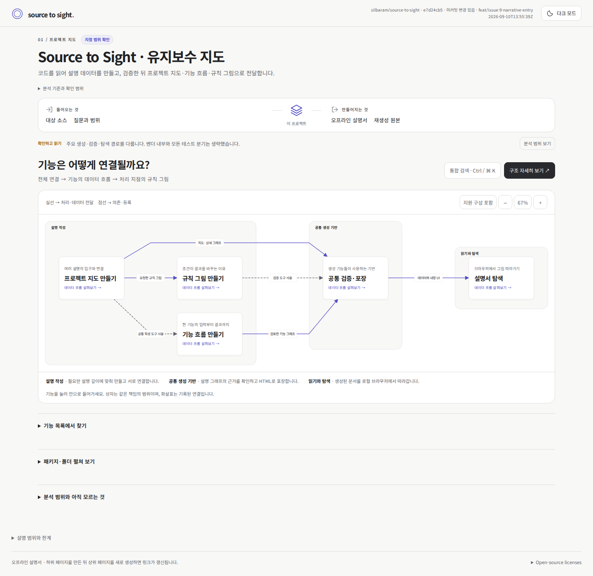

# 유지보수 문서 시각 검증

처음 프로젝트를 접하는 사람이 **전체 기능 연결 → 기능의 데이터 흐름 → 노드의 규칙 그림**을 따라 이해할 수 있는지 검토하는 문서와 화면 캡처입니다.

[개선된 프로젝트 문서 열기](source-to-sight-maintainer/project.html)

저장소를 내려받은 뒤 위 `project.html`을 브라우저에서 엽니다. 지도 1개, 기능 흐름 5개, 규칙 설명 5개가 상대 경로로 연결되어 있으므로 `source-to-sight-maintainer/` 디렉터리를 통째로 유지합니다. 별도 서버나 인터넷 연결은 필요하지 않습니다. GitHub에서는 아래 캡처로 화면을 미리 볼 수 있습니다.

| 단계 | 데스크톱 · 밝게 | 데스크톱 · 어둡게 | 모바일 · 밝게 | 모바일 · 어둡게 |
| --- | --- | --- | --- | --- |
| 전체 연결 | [보기](source-to-sight-maintainer/screenshots/map-1440-light.png) | [보기](source-to-sight-maintainer/screenshots/map-1440-dark.png) | [보기](source-to-sight-maintainer/screenshots/map-390-light.png) | [보기](source-to-sight-maintainer/screenshots/map-390-dark.png) |
| 기능 데이터 흐름 | [보기](source-to-sight-maintainer/screenshots/flow-1440-light.png) | [보기](source-to-sight-maintainer/screenshots/flow-1440-dark.png) | [보기](source-to-sight-maintainer/screenshots/flow-390-light.png) | [보기](source-to-sight-maintainer/screenshots/flow-390-dark.png) |
| 노드의 규칙 그림 | [보기](source-to-sight-maintainer/screenshots/rule-1440-light.png) | [보기](source-to-sight-maintainer/screenshots/rule-1440-dark.png) | [보기](source-to-sight-maintainer/screenshots/rule-390-light.png) | [보기](source-to-sight-maintainer/screenshots/rule-390-dark.png) |

확인 범위는 데스크톱 1440px·모바일 390px의 밝은·어두운 테마입니다. 5개 기능의 규칙 11개를 네 화면 조건에서 탐색하는 44개 경로를 확인합니다. 선택한 노드에 연결된 그림, 조건 비교 동작, 지도로 돌아올 때의 선택 복원, 페이지 가로 넘침과 외부 네트워크 요청 여부를 검사합니다. 캡처는 각 단계의 대표 화면입니다.

이 HTML은 생성 시점의 소스와 설명을 담은 검토용 스냅샷입니다. 화면 템플릿과 생성 코드는 `skills/`에서 관리하며, 이후 코드 변경이 이 문서에 자동 반영되지는 않습니다. 재생성용 원본은 로컬의 `build/source-to-sight-maintainer/_internal/project/`에 보관하고 Git에 포함하지 않습니다. 보관 기준은 [배포 파일 기준](../docs/distribution.md)을 참고하세요.
